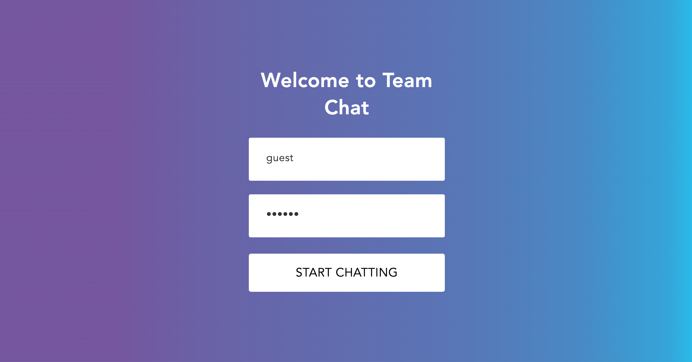

**Live Link** http://purpleteamchat.netlify.app/

<i>A React Chat App. With online statuses, avatars telling you who read the message, image upload support, user authentications, and much more.</i>

**Demo:**

  
  <i> &nbsp <i/>
  

